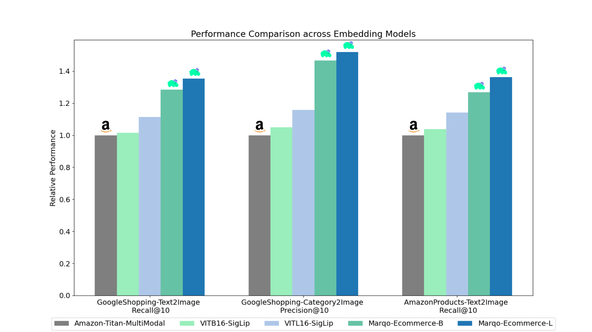

# Marqo Ecommerce Embedding Models
In this work, we introduce two state-of-the-art embedding models for ecommerce products: [Marqo-Ecommerce-B](https://huggingface.co/Marqo/marqo-ecommerce-embeddings-B) and [Marqo-Ecommerce-L](https://huggingface.co/Marqo/marqo-ecommerce-embeddings-L). 

The benchmarking results highlight a remarkable performance by marqo-ecommerce models, which both consistently outperformed all other models across various metrics. Specifically, for the Google Shopping Text-to-Image task, marqo-ecommerce-L achieved an improvement of 43% in MRR, 41% in nDCG@10 and 33% in Recall@10 when compared to ViT-B-16-SigLIP which is our baseline model for these benchmarks. For the Google Shopping Category-to-Image task, we saw an improvement of 67% in mAP, 41% in nDCG@10 and 42% in Precision@10. 

More benchmarking results can be found below.

**Released Content**: 
1) Marqo-Ecommerce-B and Marqo-Ecommerce-L embedding models
2) GoogleShopping-1m and AmazonProducts-3m for evaluation
3) Evaluation Code



## Models
| **Embedding Model** | **#Params (m)** | **Dimension** | **HuggingFace**                    | **Download .pt**                                                                                            | **Single Batch Text Inference (A10g)** | **Single Batch Image Inference (A10g)** |
|---------------------|-----------------|---------------|------------------------------------|-------------------------------------------------------------------------------------------------------------|----------------------------------------|-----------------------------------------|
| Marqo-Ecommerce-B   | 203             | 768           | [Marqo/marqo-ecommerce-embeddings-B](https://huggingface.co/Marqo/marqo-ecommerce-embeddings-B) | [link](https://marqo-gcl-public.s3.us-west-2.amazonaws.com/marqo-general-ecomm/marqo-ecomm-embeddings-b.pt) | 5.1 ms                                 | 5.7 ms                                  |
| Marqo-Ecommerce-L   | 652             | 1024          | [Marqo/marqo-ecommerce-embeddings-L](https://huggingface.co/Marqo/marqo-ecommerce-embeddings-L) | [link](https://marqo-gcl-public.s3.us-west-2.amazonaws.com/marqo-general-ecomm/marqo-ecomm-embeddings-l.pt) | 10.3 ms                                | 11.0 ms                                 |

### Load from HuggingFace with OpenCLIP
To load the models in OpenCLIP, see below. The models are hosted on [Hugging Face](https://huggingface.co/collections/Marqo/marqo-ecommerce-embeddings-66f611b9bb9d035a8d164fbb) and loaded using [OpenCLIP](https://github.com/mlfoundations/open_clip). You can also find this code inside `run_models.py`.

```
pip install open_clip_torch
```
```python
from PIL import Image
import open_clip
import requests
import torch

# Specify model from Hugging Face Hub
model_name = 'hf-hub:Marqo/marqo-ecommerce-embeddings-L'
model, preprocess_train, preprocess_val = open_clip.create_model_and_transforms(model_name)
tokenizer = open_clip.get_tokenizer(model_name)

# Preprocess the image and tokenize text inputs
# Load an example image from a URL
img = Image.open(requests.get('https://raw.githubusercontent.com/marqo-ai/marqo-ecommerce-embeddings/refs/heads/main/images/dining-chairs.png', stream=True).raw)
image = preprocess_val(img).unsqueeze(0)
text = tokenizer(["dining chairs", "a laptop", "toothbrushes"])

# Perform inference
with torch.no_grad(), torch.cuda.amp.autocast():
    image_features = model.encode_image(image, normalize=True)
    text_features = model.encode_text(text, normalize=True)

    # Calculate similarity probabilities
    text_probs = (100.0 * image_features @ text_features.T).softmax(dim=-1)

# Display the label probabilities
print("Label probs:", text_probs)
# [1.0000e+00, 8.3131e-12, 5.2173e-12]
```
### Load from HuggingFace with transformers
To load the models in Transformers, see below. The models are hosted on [Hugging Face](https://huggingface.co/collections/Marqo/marqo-ecommerce-embeddings-66f611b9bb9d035a8d164fbb) and loaded using [Transformers](https://github.com/huggingface/transformers).

```python
from transformers import AutoModel, AutoProcessor
import torch
from PIL import Image
import requests

model_name= 'Marqo/marqo-ecommerce-embeddings-L'
# model_name = 'Marqo/marqo-ecommerce-embeddings-B'

model = AutoModel.from_pretrained(model_name, trust_remote_code=True)
processor = AutoProcessor.from_pretrained(model_name, trust_remote_code=True)

img = Image.open(requests.get('https://raw.githubusercontent.com/marqo-ai/marqo-ecommerce-embeddings/refs/heads/main/images/dining-chairs.png', stream=True).raw).convert("RGB")
image = [img]
text = ["dining chairs", "a laptop", "toothbrushes"]
processed = processor(text=text, images=image, padding='max_length', return_tensors="pt")
processor.image_processor.do_rescale = False
with torch.no_grad():
    image_features = model.get_image_features(processed['pixel_values'], normalize=True)
    text_features = model.get_text_features(processed['input_ids'], normalize=True)

    text_probs = (100 * image_features @ text_features.T).softmax(dim=-1)
    
print(text_probs)
# [1.0000e+00, 8.3131e-12, 5.2173e-12]
```

### Evaluation
[Generalised Contrastiove Learning](https://github.com/marqo-ai/GCL) (GCL) is used for the evaluation. The following code can also be found in `scripts`.

```
git clone https://github.com/marqo-ai/GCL
```
Install the packages required by GCL. 

**1. GoogleShopping-Text2Image Retrieval.**
```
cd ./GCL
MODEL=hf-hub:Marqo/marqo-ecommerce-B
outdir=/MarqoModels/GE/marqo-ecommerce-B/gs-title2image
hfdataset=Marqo/google-shopping-general-eval
python  evals/eval_hf_datasets_v1.py \
      --model_name $MODEL \
      --hf-dataset $hfdataset \
      --output-dir $outdir \
      --batch-size 1024 \
      --num_workers 8 \
      --left-key "['title']" \
      --right-key "['image']" \
      --img-or-txt "[['txt'], ['img']]" \
      --left-weight "[1]" \
      --right-weight "[1]" \
      --run-queries-cpu \
      --top-q 4000 \
      --doc-id-key item_ID \
      --context-length "[[64], [0]]"
```

**2. GoogleShopping-Category2Image Retrieval.**
```
cd ./GCL
MODEL=hf-hub:Marqo/marqo-ecommerce-B
outdir=/MarqoModels/GE/marqo-ecommerce-B/gs-cat2image
hfdataset=Marqo/google-shopping-general-eval
python  evals/eval_hf_datasets_v1.py \
      --model_name $MODEL \
      --hf-dataset $hfdataset \
      --output-dir $outdir \
      --batch-size 1024 \
      --num_workers 8 \
      --left-key "['query']" \
      --right-key "['image']" \
      --img-or-txt "[['txt'], ['img']]" \
      --left-weight "[1]" \
      --right-weight "[1]" \
      --run-queries-cpu \
      --top-q 4000 \
      --doc-id-key item_ID \
      --context-length "[[64], [0]]"
```

**3. AmazonProducts-Category2Image Retrieval.**
```
cd ./GCL
MODEL=hf-hub:Marqo/marqo-ecommerce-B
outdir=/MarqoModels/GE/marqo-ecommerce-B/ap-title2image
hfdataset=Marqo/amazon-products-eval
python  evals/eval_hf_datasets_v1.py \
      --model_name $MODEL \
      --hf-dataset $hfdataset \
      --output-dir $outdir \
      --batch-size 1024 \
      --num_workers 8 \
      --left-key "['title']" \
      --right-key "['image']" \
      --img-or-txt "[['txt'], ['img']]" \
      --left-weight "[1]" \
      --right-weight "[1]" \
      --run-queries-cpu \
      --top-q 4000 \
      --doc-id-key item_ID \
      --context-length "[[64], [0]]"
```


## Detailed Performance
The benchmarks are separated into 'Marqo-Ecommerce-Hard' and '100k-Marqo-Ecommerce-Easy'. The "easy" dataset is about 10-30 times smaller, and designed to accommodate rate-limited models, specifically Cohere-Embeddings-v3 and GCP-Vertex. The "hard" dataset represents the true challenge, since it contains four million ecommerce product listings, which pushes these models to their limits in a real-world, ecommerce scenario.

Within both these scenarios, the models were benchmarked against three different tasks:

* Google Shopping Text-to-Image
* Google Shopping Category-to-Image
* Amazon Products Text-to-Image

### Marqo-Ecommerce-Hard
Marqo-Ecommerce-Hard looks into the comprehensive evaluation conducted using the full 4 million dataset, highlighting the robust performance of our models in a real-world context.

**GoogleShopping-Text2Image Retrieval.**

| **Embedding Model**         | **mAP**  | **R@10**  | **MRR**  | **nDCG@10** |
|-------------------------|------|-------|------|---------|
| **Marqo-Ecommerce-L**       | **0.682**| **0.878** | **0.683**| **0.726**   |
| Marqo-Ecommerce-B       | 0.623| 0.832 | 0.624| 0.668   |
| ViT-SO400M-14-SigLip    | 0.573| 0.763 | 0.574| 0.613   |
| ViT-L-16-SigLip         | 0.540| 0.722 | 0.540| 0.577   |
| ViT-B-16-SigLip         | 0.476| 0.660 | 0.477| 0.513   |
| Amazon-Titan-MultiModal | 0.475| 0.648 | 0.475| 0.509   |
| Jina-V1-CLIP            | 0.285| 0.402 | 0.285| 0.306   |


**GoogleShopping-Category2Image Retrieval.**  

| **Embedding Model**         | **mAP** | **P@10** | **MRR** | **nDCG@10** |
|-----------------------------|---------|----------|---------|-------------|
| **Marqo-Ecommerce-L**           | **0.463**   | **0.652**    | **0.822**   | **0.666**       |
| Marqo-Ecommerce-B           | 0.423   | 0.629    | 0.810   | 0.644       |
| ViT-SO400M-14-SigLip        | 0.352   | 0.516    | 0.707   | 0.529       |
| ViT-L-16-SigLip             | 0.324   | 0.497    | 0.687   | 0.509       |
| ViT-B-16-SigLip             | 0.277   | 0.458    | 0.660   | 0.473       |
| Amazon-Titan-MultiModal     | 0.246   | 0.429    | 0.642   | 0.446       |
| Jina-V1-CLIP                | 0.123   | 0.275    | 0.504   | 0.294       |


**AmazonProducts-Text2Image Retrieval.** 

| **Embedding Model**         | **mAP** | **R@10** | **MRR** | **nDCG@10** |
|-----------------------------|---------|----------|---------|-------------|
| **Marqo-Ecommerce-L**           | **0.658**   | **0.854**    | **0.663**   | **0.703**       |
| Marqo-Ecommerce-B           | 0.592   | 0.795    | 0.597   | 0.637       |
| ViT-SO400M-14-SigLip        | 0.560   | 0.742    | 0.564   | 0.599       |
| ViT-L-16-SigLip             | 0.544   | 0.715    | 0.548   | 0.580       |
| ViT-B-16-SigLip             | 0.480   | 0.650    | 0.484   | 0.515       |
| Amazon-Titan-MultiModal     | 0.456   | 0.627    | 0.457   | 0.491       |
| Jina-V1-CLIP                | 0.265   | 0.378    | 0.266   | 0.285       |


### 100k-Marqo-Ecommerce-Easy
This dataset is about 10-30 times smaller than the Marqo-Ecommerce-Hard, and  designed to accommodate rate-limited models, specifically Cohere-Embeddings-v3 and GCP-Vertex.

**GoogleShopping-Text2Image Retrieval.**

| **Embedding Model**         | **mAP** | **R@10** | **MRR** | **nDCG@10** |
|-----------------------------|---------|----------|---------|-------------|
| **Marqo-Ecommerce-L**           | **0.879**   | **0.971**    | **0.879**   | **0.901**       |
| Marqo-Ecommerce-B           | 0.842   | 0.961    | 0.842   | 0.871       |
| ViT-SO400M-14-SigLip        | 0.792   | 0.935    | 0.792   | 0.825       |
| GCP-Vertex                  | 0.740   | 0.910    | 0.740   | 0.779       |
| ViT-L-16-SigLip             | 0.754   | 0.907    | 0.754   | 0.789       |
| ViT-B-16-SigLip             | 0.701   | 0.870    | 0.701   | 0.739       |
| Amazon-Titan-MultiModal     | 0.694   | 0.868    | 0.693   | 0.733       |
| Jina-V1-CLIP                | 0.480   | 0.638    | 0.480   | 0.511       |
| Cohere-embedding-v3         | 0.358   | 0.515    | 0.358   | 0.389       |


**GoogleShopping-Category2Image Retrieval.**  

| **Embedding Model**         | **mAP** | **P@10** | **MRR** | **nDCG@10** |
|-----------------------------|---------|----------|---------|-------------|
| **Marqo-Ecommerce-L**           | **0.515**   | **0.358**    | **0.764**   | **0.590**       |
| Marqo-Ecommerce-B           | 0.479   | 0.336    | 0.744   | 0.558       |
| ViT-SO400M-14-SigLip        | 0.423   | 0.302    | 0.644   | 0.487       |
| GCP-Vertex                  | 0.417   | 0.298    | 0.636   | 0.481       |
| ViT-L-16-SigLip             | 0.392   | 0.281    | 0.627   | 0.458       |
| ViT-B-16-SigLip             | 0.347   | 0.252    | 0.594   | 0.414       |
| Amazon-Titan-MultiModal     | 0.308   | 0.231    | 0.558   | 0.377       |
| Jina-V1-CLIP                | 0.175   | 0.122    | 0.369   | 0.229       |
| Cohere-embedding-v3         | 0.136   | 0.110    | 0.315   | 0.178       |


**AmazonProducts-Text2Image Retrieval.** 

| **Embedding Model**         | **mAP** | **R@10** | **MRR** | **nDCG@10** |
|-----------------------------|---------|----------|---------|-------------|
| **Marqo-Ecommerce-L**           | **0.92**   | **0.978**    | **0.928**   | **0.940**       |
| Marqo-Ecommerce-B           | 0.897   | 0.967    | 0.897   | 0.914       |
| ViT-SO400M-14-SigLip        | 0.860   | 0.954    | 0.860   | 0.882       |
| ViT-L-16-SigLip             | 0.842   | 0.940    | 0.842   | 0.865       |
| GCP-Vertex                  | 0.808   | 0.933    | 0.808   | 0.837       |
| ViT-B-16-SigLip             | 0.797   | 0.917    | 0.797   | 0.825       |
| Amazon-Titan-MultiModal     | 0.762   | 0.889    | 0.763   | 0.791       |
| Jina-V1-CLIP                | 0.530   | 0.699    | 0.530   | 0.565       |
| Cohere-embedding-v3         | 0.433   | 0.597    | 0.433   | 0.465       |


## Citation
```
@software{zhu2024marqoecommembed_2024,
        author = {Tianyu Zhu and and Jesse Clark},
        month = oct,
        title = {{Marqo Ecommerce Embeddings - Foundation Model for Product Embeddings}},
        url = {https://github.com/marqo-ai/marqo-ecommerce-embeddings/},
        version = {1.0.0},
        year = {2024}
        }
```


