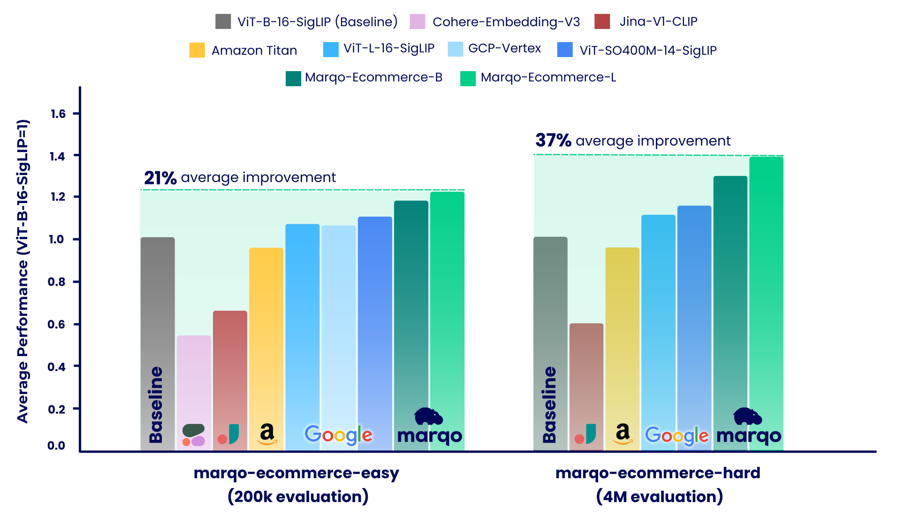

# Marqo E-commerce Embedding Models
In this work, we introduce two state-of-the-art embedding models for e-commerce: 
Marqo-Ecommerce-B and Marqo-Ecommerce-L. 
They are over 30% better compared to Amazon Titan Embedding services for e-commerce retrieval tasks.

**Released Content**: 
1) Marqo-Ecommerce-B and Marqo-Ecommerce-L embedding models
2) GoogleShopping-1m and AmazonProducts-3m for evaluation
3) Evaluation Code



## Models

| **Embedding Model** | **#Params (m)** | **Dimension** | **HuggingFace**                    | **Download .pt**                                                                                            |
|---------------------| --- |---------------|------------------------------------|-------------------------------------------------------------------------------------------------------------|
| Marqo-Ecommerce-B   | 203 | 768           | Marqo/marqo-ecommerce-embeddings-B | [link](https://marqo-gcl-public.s3.us-west-2.amazonaws.com/marqo-general-ecomm/marqo-ecomm-embeddings-b.pt) |
| Marqo-Ecommerce-L   | 652 | 1024          | Marqo/marqo-ecommerce-embeddings-L | [link](https://marqo-gcl-public.s3.us-west-2.amazonaws.com/marqo-general-ecomm/marqo-ecomm-embeddings-l.pt)                                       |

### HuggingFace with OpenCLIP
```
pip install open_clip_torch
```
```python
from PIL import Image
import open_clip
import requests
import torch

# Specify model from Hugging Face Hub
model_name = 'hf-hub:Marqo/marqo-ecommerce-embeddings-B'
model, preprocess_train, preprocess_val = open_clip.create_model_and_transforms(model_name)
tokenizer = open_clip.get_tokenizer(model_name)

# Preprocess the image and tokenize text inputs
# Load an example image from a URL
img = Image.open(requests.get('https://raw.githubusercontent.com/marqo-ai/marqo-FashionCLIP/main/docs/fashion-hippo.png', stream=True).raw)
image = preprocess_val(img).unsqueeze(0)
text = tokenizer(["a hat", "a t-shirt", "shoes"])

# Perform inference
with torch.no_grad(), torch.cuda.amp.autocast():
    image_features = model.encode_image(image, normalize=True)
    text_features = model.encode_text(text, normalize=True)

    # Calculate similarity probabilities
    text_probs = (100.0 * image_features @ text_features.T).softmax(dim=-1)

# Display the label probabilities
print("Label probs:", text_probs)
# [9.9955e-01, 4.4712e-04, 4.4010e-06]]
```
### HuggingFace with transformers
```python
from transformers import AutoModel, AutoProcessor
import torch
from PIL import Image
import requests
# model_name= 'Marqo/marqo-ecommerce-embeddings-L'
model_name = 'Marqo/marqo-ecommerce-embeddings-B'

model_1 = AutoModel.from_pretrained(model_name, trust_remote_code=True)
processor_1 = AutoProcessor.from_pretrained(model_name, trust_remote_code=True)

img = Image.open(requests.get('https://raw.githubusercontent.com/marqo-ai/marqo-FashionCLIP/main/docs/fashion-hippo.png', stream=True).raw).convert("RGB")
image_1 = [img]
text_1 = ["a hat", "a t-shirt", "shoes"]
processed_1 = processor_1(text=text_1, images=image_1, padding='max_length', return_tensors="pt")
processor_1.image_processor.do_rescale = False
with torch.no_grad():
    image_features_1 = model_1.get_image_features(processed_1['pixel_values'], normalize=True)
    text_features_1 = model_1.get_text_features(processed_1['input_ids'], normalize=True)

    text_probs_1 = (100 * image_features_1 @ text_features_1.T).softmax(dim=-1)
    
print(text_probs_1)
# [9.9955e-01, 4.4712e-04, 4.4010e-06]]
```

### Evaluation with GCL
```
git clone https://github.com/marqo-ai/GCL
```
Install the packages required by GCL. 
```
cd ./GCL
MODEL=hf-hub:Marqo/marqo-ecommerce-B
outdir=/MarqoModels/GE/marqo-ecommerce-B/gs-title2image2
hfdataset=Marqo/google-shopping-general-eval
python  evals/eval_hf_datasets_v1.py \
      --model_name $MODEL \
      --hf-dataset $hfdataset \
      --output-dir $outdir \
      --batch-size 1024 \
      --num_workers 8 \
      --left-key "['title']" \
      --right-key "['image']" \
      --img-or-txt "[['txt'], ['img']]" \
      --left-weight "[1]" \
      --right-weight "[1]" \
      --run-queries-cpu \
      --top-q 4000 \
      --doc-id-key item_ID \
      --context-length "[[64], [0]]"
```


## Detailed Performance
**GoogleShopping-Text2Image Retrieval.**

| **Embedding Model** | **mAP** | **P@10** | **R@10** | **MRR** |
| --- | --- | --- | --- | --- |
| Marqo-Ecommerce-L | **0.682** | **0.089** | **0.878** | **0.683** |
| Marqo-Ecommerce-B | 0.623 | 0.084 | 0.832 | 0.624 |
| Amazon-Titan-MultiModal | 0.475 | 0.065 | 0.648 | 0.475 |
| ViT-B-16-SigLip | 0.476 | 0.067 | 0.660 | 0.477 |
| ViT-L-16-SigLip | 0.540 | 0.073 | 0.722 | 0.540 |


**GoogleShopping-Category2Image Retrieval.**  

| **Embedding Model** | **mAP** | **P@10** | **MRR** | **nDCG@10** |
| --- | --- | --- | --- | --- |
| Marqo-Ecommerce-L | **0.463** | **0.652** | **0.822** | **0.666** |
| Marqo-Ecommerce-B | 0.423 | 0.629 | 0.810 | 0.644 |
| Amazon-Titan-MultiModal | 0.246 | 0.429 | 0.642 | 0.446 |
| ViT-B-16-SigLip | 0.277 | 0.458 | 0.660 | 0.473 |
| ViT-L-16-SigLip | 0.324 | 0.497 | 0.687 | 0.509 |

**AmazonProducts-Text2Image Retrieval.** 

| **Embedding Model** | **mAP** | **P@10** | **R@10** | **MRR** |
| --- | --- | --- | --- | --- |
| Marqo-Ecommerce-L | **0.658** | **0.096** | **0.854** | **0.663** |
| Marqo-Ecommerce-B | 0.592 | 0.089 | 0.795 | 0.597 |
| Amazon-Titan-MultiModal | 0.456 | 0.064 | 0.627 | 0.457 |
| ViT-B-16-SigLip | 0.480 | 0.070 | 0.650 | 0.484 |
| ViT-L-16-SigLip | 0.544 | 0.077 | 0.715 | 0.548 |


